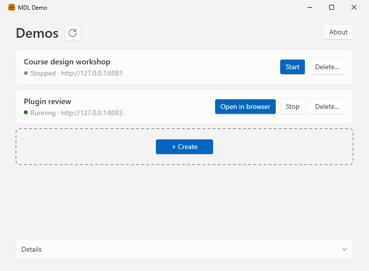
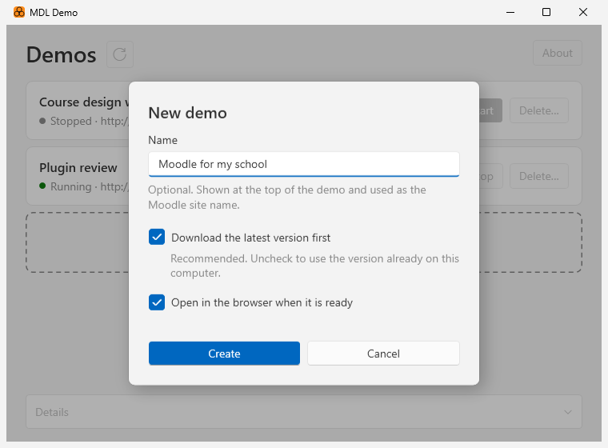

# MDL Demo App

A small Windows app for trying Moodle™ or MuTMS on your own computer. It
creates, starts, stops and deletes [mdl-demo](https://github.com/mutms/mdl-demo)
sites for you, with no commands to type.

Each demo runs in its own container, a small computer inside your own that
cannot touch the rest of your machine. Only your computer can see it.



## What you need

- **Windows 11**, 64-bit (Intel or AMD).
- **The Windows Subsystem for Linux (WSL)** with containers, a free part of
  Windows from Microsoft. Open Terminal as administrator and run:

  ```powershell
  wsl --install --no-distribution
  ```

  then restart the computer. If you already have WSL, update it instead with
  `wsl --update`. See Microsoft's [WSL containers](https://aka.ms/wslc) page for
  details.

If WSL is missing or too old, MDL Demo tells you what to do.

## Download

1. Download `mdl-demo-unsigned.zip` from the
   [latest release](https://github.com/mutms/mdl-demo-win/releases/latest).
2. Unzip it and run `mdl-demo.exe`.

There is nothing to install: the app is a single file. Keep it wherever you
like, for example on the desktop.

### "Windows protected your PC"

For now, MDL Demo releases are **not signed** with a code-signing
certificate. Windows cannot tell who made an unsigned app, so the first time
you run it, Microsoft Defender SmartScreen shows a blue "Windows protected your
PC" window.

To run it anyway, click **More info**, then **Run anyway**. Windows remembers
your choice for this file.

Only do this with a copy you downloaded from this project's
[releases page](https://github.com/mutms/mdl-demo-win/releases). If you would
rather not run an unsigned file, you can build the app yourself from this
source code (see [Building](#building)).

## Using it

- **+ Create** makes a new demo. Give it a name if you like; by default it
  first downloads the latest version of mdl-demo and then opens the demo in
  your browser, where you pick a Moodle version and set up the site.
- **Open in browser** takes you back to a running demo.
- **Stop** shuts a demo down when you do not need it; its site and data are
  kept. **Start** brings it back.
- **Delete…** removes a demo together with its site and all its data.
- **About** shows the version and where the app comes from. Its
  **Free disk space…** button removes downloaded versions that no demo uses.



Each demo gets its own address: the first one is <http://127.0.0.1:8081>, the
next <http://127.0.0.1:8083> and so on. MDL Demo skips ports that other
programs on your computer already use.

MDL Demo speaks English, Czech and German: it uses the language of Windows,
and English when Windows is set to any other language.

MDL Demo does the same as the `mdl-demo.cmd` helper from
[mdl-demo](https://github.com/mutms/mdl-demo/blob/main/WINDOWS.md), so demos
made with either one show up in both.

## Building

You need the [.NET 10 SDK](https://dotnet.microsoft.com/download/dotnet/10.0):

```powershell
winget install Microsoft.DotNet.SDK.10
```

Run the app from the source:

```powershell
dotnet run --project src\MDL_Demo
```

Build the release files `dist\mdl-demo.exe` and `dist\mdl-demo-unsigned.zip`:

```powershell
src\build-release.cmd
```

## Security

To report a security problem, see [SECURITY.md](SECURITY.md).

## AI disclosure

Most of this project was written with the help of Claude (Anthropic). A human
maintainer reviewed, corrected and accepted everything before it was committed.
The design decisions and the final code are the maintainers' own.

## License

Copyright (c) 2026 Petr Skoda. [MIT](LICENSE).

Moodle™ is a registered trademark of Moodle Pty Ltd. MuTMS is an independent
project not affiliated with or endorsed by Moodle Pty Ltd.
